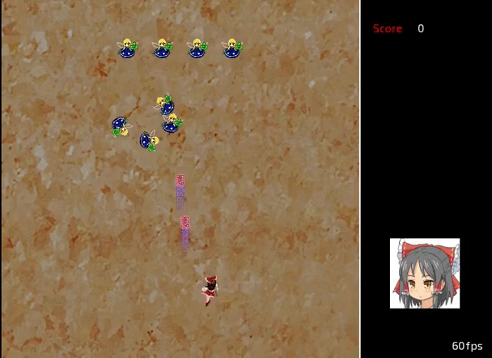

# Teki ([敵](https://en.wiktionary.org/wiki/%E6%95%B5))

Teki is an open-source fangame of the [Tōhō](https://en.wikipedia.org/wiki/Touhou_Project) series, written in Rust using [SDL2](https://github.com/Rust-SDL2/rust-sdl2) and OpenGL.

<p align="center"></p>

<p align="center"><a href="https://o2sh.github.io/teki/">Play online!</a></p>

### Building

Since teki depends on SDL2, you first need to
[install the SDL2 development libraries](https://github.com/Rust-SDL2/rust-sdl2#sdl20-development-libraries).

Once SDL2 is set up, you can build and run the app simply using:

```bash
cargo run
```

### How to play (Control)

- The Arrow Keys move the character around
- Z causes a short barrage of shots to be fired; it may be held down for rapidfire
- X releases a bomb, also known as a Spell Card (presuming that any are left)
- Esc pauses the game and brings you to the in-game menu
