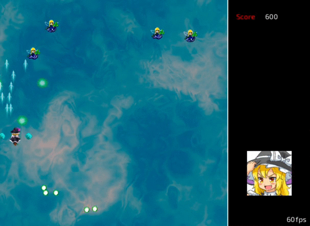

# Teki ([敵](https://en.wiktionary.org/wiki/%E6%95%B5))

[![crates][s1]][l1] ![MIT][s2]

[s1]: https://img.shields.io/crates/v/teki.svg
[l1]: https://crates.io/crates/teki
[s2]: https://img.shields.io/badge/license-MIT-blue.svg

Touhou-style shoot'em up written in Rust using legion and sdl2.

<h3 align="center"></h3>

### How to play (Control)

  * Arrow key : Move left, right, up or down
  * Space key : Shoot a bullet
